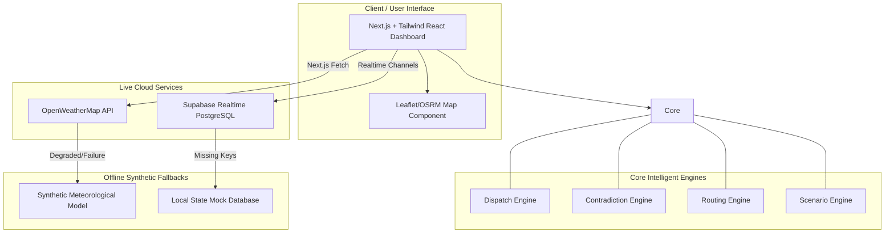

# 🚨 MEDUSA: Medical Emergency Dispatch & Unified Scenario Analysis

MEDUSA is a premium, real-time emergency dispatch and automated intelligence-orchestration dashboard. Designed for crisis dispatchers, medical logistics teams, and field commanders, MEDUSA aggregates raw emergency signals, resolves conflicting field data, manages active responder units, and automates vehicle routing dynamically.


**Live Service:** [Access the Web Dashboard](https://medusa-frontend-1071246692114.us-central1.run.app) | **Android App:** [Download the Mobile APK](https://github.com/NeuraHals/MEDUSA/releases) (compiled using Capacitor)

---

## 📐 System Architecture Overview

MEDUSA is structured as a cloud-native Next.js application designed to run entirely locally in decoupled mock environments, or in real-time serverless environments integrated with Google Cloud and Supabase.



### Core Architecture Components:
1. **Intelligent Contradiction Engine**: Solves the "fog of war" in crisis dispatch by mathematically weighing opposing reports (e.g. social media rumors vs. official telemetry) using a reliability matrix, scoring confidence levels, and offering automated recommendations.
2. **Auto-Dispatch & Routing Engine**: Automatically selects the nearest active ambulance using geographic coordinates, calculates the quickest route to the incident, identifies the most suitable hospital by current occupancy, and schedules the dispatch.
3. **Decoupled Database Controller**: Detects if database keys are present. If a live PostgreSQL/Supabase instance is unavailable, it boots up an in-memory client-side mock backend ensuring 100% dashboard interactivity.
4. **Network Degradation Manager**: Actively monitors external Web APIs (such as OpenWeatherMap). If an API times out, fails, or throttles, the system alerts the operator and immediately activates offline synthetic estimation caches without crashing.

---

## 🌟 Core Feature List

* **🗺️ Real-time Tactical Map**: A rich visual interface utilizing interactive geographic plots to track hospitals (load indices), emergency incidents, active routes, and ambulance location vectors.
* **🧠 Discrepancy & Contradiction Board**: Highlights contradictory inputs on identical locations (such as automated telemetry claiming 91% occupancy while manual administration claims 45%). Calculates a dynamic **Confidence Score** and flags warnings.
* **⚡ Smart Auto-Dispatch**: Matches incidents with the closest available emergency responders using GPS vectors, reserving manual override for control room operators.
* **🔧 Instant Failure Simulators**: Interactive control panels allowing dispatchers to intentionally simulate API failures, database disruptions, or mass casualties to observe system auto-scaling and fallback responses.
* **📱 Android-Ready Integration**: Pre-wrapped with **CapacitorJS**, enabling compiling into a native mobile dashboard APK directly from the same codebase.

---

## 🛠️ Local Setup Guide

Follow these steps to run the MEDUSA dashboard locally on your machine.

### Prerequisites
* **Node.js**: Version `22.x` or higher
* **npm**: Version `10.x` or higher
* **Google Cloud CLI** *(optional, for remote deployment)*

### Installation

1. Clone or navigate to your project directory:
   ```bash
   cd C:\Users\l\OneDrive\Documents\MEDUSA\frontend
   ```

2. Install the required Node dependencies:
   ```bash
   npm install
   ```

3. Run the development server:
   ```bash
   npm run dev
   ```

4. Open your browser and go to: **[http://localhost:3000](http://localhost:3000)**

### Configure Environment Variables (For Live Production Data)
Create a `.env.local` file in your root folder to connect a live Supabase instance:
```env
NEXT_PUBLIC_SUPABASE_URL=your_supabase_project_url
NEXT_PUBLIC_SUPABASE_ANON_KEY=your_supabase_anon_key
```
*If left blank, the app will run entirely in interactive Mock/Demo mode using simulated in-memory databases.*

---

## 🎬 Recommended Demo Walkthrough

Once you open the dashboard, try this demo flow to test MEDUSA’s core systems:

1. **Step 1: Check the Tactical Map**
   Observe the live GPS tracking of ambulances and the green/red status rings around hospitals (indicating current emergency room load).
2. **Step 2: Review the Contradiction Panel**
   Observe the active discrepancies. For example, note the **FDR Drive Road Conditions** card where social media reports heavy flooding, but road sensors report normal weather. Click **Verify / Accept** to act on the auto-calculated high-confidence recommendation.
3. **Step 3: Trigger a Simulated Failure**
   In the control sidebar, toggle the **"Force API Failure"** switch. You will immediately notice a warning pop up indicating that the weather service has degraded, and the dashboard seamlessly pivots to generating local **Synthetic Meteorological Cache Models** to keep dispatch routines online.
4. **Step 4: Dispatch an Ambulance**
   Create an emergency incident on the map. Watch the **Dispatch Engine** instantly highlight the closest available ambulance, render a route, and schedule an auto-dispatch to the optimal nearby hospital.

---

## 🔌 Integrated Services & APIs

* **Supabase (PostgreSQL)**: Handles real-time client-to-client subscriptions, broadcasting GPS coordinate changes, and logging emergency status alterations.
* **OpenWeatherMap API**: Provides live meteorological data utilized by the contradiction engine to cross-verify road incidents against official weather logs.
* **Open Source Routing Machine (OSRM)**: Calculates geographic road routes, distance matrices, and estimated times of arrival (ETA) for responder fleets.
* **Leaflet / OpenStreetMap**: Drives the interactive tactical vector maps.

---

## 🛡️ Resilient Fallback Mechanics

MEDUSA is engineered to survive complete network and data loss during active crises.

| Dependency | Under Normal Conditions | Under Degraded / Offline Conditions |
| :--- | :--- | :--- |
| **Supabase Database** | Connects to Cloud PostgreSQL, listens to real-time sync queries. | Detects missing configuration (`isPlaceholderSupabase = true`) and switches immediately to client-side in-memory mock controllers. |
| **Weather Service** | Pulls real-time temperature, wind, and precipitation states from OpenWeatherMap. | Triggers a custom timeout `AbortController`. If API fails, alerts dashboard and swaps to a localized, predictable synthetic barometric model. |
| **Routing Services** | Fetches live ETA and navigation paths from an OSRM instance. | Falls back instantly to direct Great-Circle distance mapping algorithms to estimate travel time without freezing the interface. |

---

## 📱 How to Access the App

You have three convenient ways to access and manage your MEDUSA build:

1. **Production Web URL**: **[https://medusa-frontend-1071246692114.us-central1.run.app](https://medusa-frontend-1071246692114.us-central1.run.app)** (Deployed on serverless Google Cloud Run).
2. **Local Environment**: Run `npm install` followed by `npm run dev` to launch **[http://localhost:3000](http://localhost:3000)** locally.
3. **Mobile APK File**: 
   * Navigate to the android folder: `C:\Users\l\OneDrive\Documents\MEDUSA\frontend\android`
   * Build using Android Studio by running `npx cap open android` and selecting **Build > Build APK(s)** in Android Studio.
